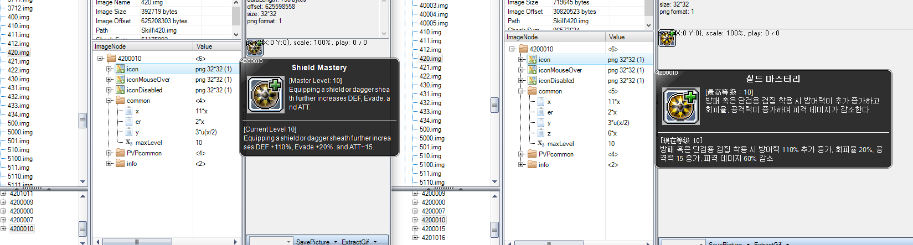

# Shadower Remaster

I'm a level 271 Shadower in MapleSEA. Been playing this class since I fell in love with it in RED, and the remaster is a significant event that's going to affect us for years to come. So I'd like to share my thoughts on the remaster while I can, whether or not it sways the decisions behind these changes.

## Convenience changes

These are the most uninteresting changes, so I'll quickly get them over with.

### Flip the Coin Toggle

Flip is now a toggle. Crit rate from 10% per stack to 5% per stack. Stacks are gained by landing critical hits while the toggle is on, and will stay indefinitely until toggled off or the buff is removed.

Crit rate difference is made up for in 2nd job passive, which now gives 25% crit and 5% crit damage (the average of 0% to 10% of Prima Critical at 4th job, which is now removed).

### Meso Guard, Dagger Booster, Haste, Shadower Instinct Passive

Meso Guard is now a passive 60% damage reduction in Shield Mastery. Booster is renamed to Dagger Acceleration and is now passive. Haste is now completely passive.

While I appreciate having one less thing to put on pet buff, Booster being passive now makes it harder to lab and test attack speed-related mechanics.

Shadower Instinct passively gives the maximum of 70 ATT.

## Minor Skill changes / removals

### Double Stab (and Lucky Seven) mobbing

Double Stab now hits 5 targets in a small area.

### Dark Flare redesign

<video src="https://user-images.githubusercontent.com/12583972/148745199-c8f71ae7-cfe8-463e-9f86-c7dac48b9b9e.mp4" controls="controls" style="max-width: 730px;"></video>

Dark Flare now hits 3 targets, up from 1. Damage reflection functionality removed. Attack interval from 900ms to 930ms.

Time from install to first attack reduced.

Leftward range reduced by 1px, rightward range increased by 1px.

### Savage Blow adjustment

Animation sped up by 30ms. Damage increased from 192% to 210%.  Downward range increased by 35px, backward range increased by 10px, forward range reduced by 10px.

### Edge Carnival mobbing skill

8 targets in a decent area. Vertical range larger than current Boomerang Stab. Damage adjusted from 160%x7 to 190%x4. Cast delay reduced from 840ms to 750ms.

### Muspelheim speedup

By 30ms.

### Smokescreen 

Size increased: +40px upward range, +40px downward range, +80px leftward range. Cast delay reduced from 900ms to 810ms. Superstance while casting.

Smoke no longer breaks Dark Sight when used.

### Eviscerate

Invincibility time has been increased to 2 seconds. Wound stacks now prioritise highest HP target of Assassinate.

## Major Skill changes / removals

### Thief Agility - Up Jump

2nd job now adds a passive that enables up jump. Can be used with Up + Jump keys, Up + flash jump hotkey. Compared to Cygnus Knights' up jump, is slightly weaker, but is ok.

However, the jump cannot be mixed-and-matched like NW/Kinesis Up jump/Flash jumps. If you use an up jump, you can't flash jump after. If you flash jump, you can't up jump after.

### Steal Toggle

Steal is now a toggle that applies to all attacks. Its proc rate was reduced from 49% to 10% as a result. Mobs will drop potions that heal full HP/MP when looted. If the target stolen from is tagged as a Boss monster, the potion will give 30 ATT for 3 minutes on top of healing.

Steal still will only affect each target once ever, so it's not free sustain on a single-target boss. But if the boss has a lot of summons, it will produce potions everywhere for your pets to loot to heal and bypass potion cooldown, vastly improving self-suatain in fights like Lucid P1. In fact, it might just be ridiculously overpowered compared to other class' self-sustain which usually only heals up to 10% of their HP on a cooldown.

For farming purposes it's basically a free 10% Auto-steal line.

### Boomerang Stab - Cruel Stab

Skill renamed. Upward range increased by 45px, downward range increased by 35px. Damage adjusted from 375%x4 to 250%x6.

I don't understand why they keep reducing this skill's damage. First it was 742%x2, then 375%x4, now 250%x6. At first glance it's an easy tradeoff to get more lines. But with the Boomerang Stab - Bonus Attack, it went from 742%x3 = 2226%, to 375%x5 = 1875%, and then 250%x7 = 1750%. Please stop making it harder to one-shot at Hotel Arcs.

For lower-level hunting it's an improvement because more lines = more coins. But please re-adjust the damage to keep the hyper in mind.

The vertical range increase is welcome, but compared to some other toys that other classes get for their mobbing - Raging Blow has 77px higher upward range, 45px more downward range, 30px more backward range but 84px less forward range, for example - this is more like a mobbing skill you'd see on a 2015 class than a 2022 class. Please consider being more generous on the AoE.

### Assassinate

Nate 1 damage decreased from 275% to 270%, downward range increased by 30px. Cast delay sped up from 840ms to 690ms.

Nate 2 damage increased from 350% to 490%, forward range increased by 60px, downward range increased by 30px. Flesh Nate 2 (enhanced Nate 2 from meso-weaving, more on this later) hits 50px higher and 40px forward.

The old Killing Point system boosted both Nate 1 and Nate 2. Current system only boosts Nate 2 with 100% final damage. Assuming 100% KP rate for the old system (100% was basically impossible, so this is just an upper bound), old damage did (275% + 350%) x2 = 1250%x6 per 2 Nates while new Nate does 270% + 490%x2 = 1250%. So the current Assassinate combo, assuming full Flesh stacks, is tuned around having 100% KP.

Increasing the range of Nate 2 is meaningless. If you're going to make Shadowers have two different versions of their bossing skill with forced alternation, it's more than mildly annoying to have the two attacks have different ranges. I don't need more horizontal range on Nate 1, if the class concept as a melee dagger-wielder getting up close and personal is too important to sacrifice. But do increase its vertical range to match Nate 2, because it produces situations where wound stacks hit things that you wouldn't expect.

(The latter phenomenon isn't as much of a problem anymore because Wound stacks now prioritise highest-HP targets, but it's still fundamentally bad design to have the bossing skill involuntarily change AoE; the effective AoE is just going to be the smaller once.)

### New Skills: Bloody Pocket, Bloody Explosion

Because of the removal of Prima Critical and Shadower Instinct, Bloody Pocket gets Prima Critical's 20% crit damage passive and Shadower Instinct's Killing Points has been replaced with a Murderous Intent buff, which is consumed to enhance the next Nate 2 to deal 100% increased final damage. The Murderous Intent buff is obtained when Bloody Explosion hits an enemy.

Bloody Pocket is the Shadower's version of an Enrage bossing-type toggle. It replaces Pickpocket to drop red-coloured coins instead of gold ones, and replaces Meso Explosion with Bloody Explosion. While Meso Explosion is a skill that activates the coins around you to seek out enemies and home in on them, Bloody Explosion is a fixed attack with a well-defined hitbox in front of you that matches Nate 1. This attack does 240%x5 damage, and each line is increased by 10%p per red coin used. Bloody Explosion has a 0.7 second cooldown, and a 630ms cast delay (at 6as). Because it is a fixed attack, it is affected by Shadow Partner.

Meso Explosion does 100%x2 per coin, but this is increased by 20%p with the Greed passive at 3rd job, so it does 240% per coin. Bloody Explosion does 250%x5 * 1.7 = 2125% at one coin, but damage per coin increases only by 85% instead of 240%. At 13 coins, Meso Explosion would deal 3120% damage while Bloody Explosion would deal 3145% damage, and at any more coins Bloody Explosion actually does less damage than Meso Explosion.

So Bloody Explosion does less damage than Meso Explosion at 7+ coins, has a cooldown while Meso Explosion does not, and has a cast animation while Meso Explosion does not. At the 40% proc rate of Pickpocket, with 24 lines of damage from Nate 1 + Nate 2, there will be an average of 9.6 coins left. So using Bloody Explosion on average is a damage increase from Meso Explosion.

### Sonic Blow adjustments

<video src="https://user-images.githubusercontent.com/12583972/148732024-dad27bd3-bd22-4a0e-8318-689d3ddbfd8d.mp4" controls="controls" style="max-width: 730px;"></video>

Sonic Blow had a 80 second cooldown that could be reduced further by attacking with Killing Points. It has been reduced to 45 seconds fixed because Killing Points have been removed. Sonic Blow now inflicts Wound Stacks on the highest HP enemy attacked and can be cancelled with Eviscerate. If cancelling with Eviscerate causes damage loss, then Sonic Blow's cooldown is reduced by 2.5 seconds for each tick of damage lost (total of 15 ticks possible).

While this may initially sound like a damage loss to cancel, there is a considerable period of end-lag after all 15 instances of damage have already applied, and this end-lag can still be cancelled. This helps get more damage out in a small timeframe and is a welcome change, since there may be times where a boss appears without Wound stacks and there's no time to apply 3 stacks to Eviscerate them before they disappear again.

## Opinions

So to answer all of the people who've been asking me what I think about the Shadower changes, I'm going to break it down into different aspects.

### Damage output

<iframe width="560" height="315" src="https://www.youtube.com/embed/uiWVB59Pe5Q" title="YouTube video player" frameborder="0" allow="accelerometer; autoplay; clipboard-write; encrypted-media; gyroscope; picture-in-picture" allowfullscreen></iframe>

A KMS Shadower who I've known to be very scientific in testing all the different aspects of Shadower has tested the total 3 minute damage output.

The Remaster has increased Shadower's damage, primarily because they balanced the new Assassinate's damage around 100% 3KP-boosted Nate 1 which almost no one was getting. Bloody Explosion does notably more than Meso Explosion as well. As far as numbers go, the balance team definitely know what they're doing.

### Background behind Meso Weaving

Before I go into my opinions about the new Bloody Explosion, I feel it necessary to cover some background information.

#### The Killing Point System

The Killing Point system was introduced in Justice Patch and had a long history, but I'll summarise how it worked right before this remaster.

Shadower Instinct passively lets you get up to 3 Killing Points, which are accumulated just by damaging any enemy with any attack other than Assassinate. If Assassinate was used with 3 Killing Points, its final damage would be increased by 2x. However, Nate 1 and Nate 2 interacted with Killing Points differently.

Nate 1:

* would help accumulate Killing Points
* would be boosted by 2x if used when there are already 3 Killing Points (i.e.g using it at 2 KP to go from 2 to 3 did not increased its damage)
* would NOT consume the Killing Points even if used with 3KP

Nate 2:

* did NOT accumulate Killing Points at all
* would be boosted by 2x if used with 3KP
* would consume the Killing Points

So, under this system, if a Shadower had 3KP and used Nate1-Nate2, both would be unconditionally boosted by the Final Damage.

The main way to accumulate killing Points was via Meso Explosion, which threw lots of coins everywhere and gave 1KP per coin - making it trivially easy to stack to 3KP almost all the time. As long as you used Meso Explosion at least once every 2 Assassinates, you'd basically always be throwing at least 3 coins around, which meant that basically every Nate 2 was being boosted with 3KP.

But there was further optimisation to be made. In order for every Nate 2 to be boosted with 3KP, the only thing you had to do was throw 2 coins inbetween each Nate2 in the Nate1-Nate2-Nate1-Nate2 cycle. That wasn't a problem. The issue was boosting Nate 1 as well, for even more damage. Because, as we covered earlier, if Nate 1 was boosted, then the next Nate 2 would guaranteed to be boosted too.

So the ideal situation was to have the coins hit between Nate2 and Nate 1.

#### Problems with Meso Explosion

Meso Explosion became what we know it today when in 2016, right before the V update, they allowed it to be used during other skills. This effectively created Meso weaving as we know it today. But even though it could be used during other skills, *other skills couldn't be used during Meso Explosion*. So in a sense, it had its own delay. And this delay was longer than Nate2, so using A-A-M would be slowing down your Assassinates, which wasn't ideal. People eventually settled on A-M-A and accepted the fact that Nate 1 wasn't meant to be boosted.

Meso Explosion had its own set of problems around 2016. To recap, this is how Meso Explosion worked:

* Meso Explosion would first check for whether there were any Pickpocket coins dropped. This is known client-side in the buff bar at the top right.
* Meso Explosion would then search for coins in a radius around the character. Because coins are coded as items that are pickable, these item locations had to be confirmed server-side.
* Meso Explosion would then search for targets around the character. Monster positions are loaded client-side in memory, but again, their locations had to be confirmed server-side as a security measure against hacking.
* Meso Explosion would then consume the coins around the character, calculate the trajectories, and send the homing missiles flying.
* After the coins flew and impacted the target, only when would the damage be registered.

During this entire process, there are multiple round-trips between the client and the server, and Meso Explosion was considered "in use" throughout, so high-latency users were basically stunned while using Meso Explosion.

The complex process also meant that there was a significant lag-time between when the Meso Explosion button is pressed and when the damage actually registers - a.k.a, when the Killing Points were counted. So even low-latency users had a significant delay between button press and 3KP registering.

#### The AWAKE Patch

The AWAKE patch resolved many of the issues with Meso Explosion, with the patch note:

> Overall skill logic has been improved to help alleviate the error where an entered skill would not activate due to things such as potion use, pet auto buff and auto feed, or skill activations that do not affect character actions.

This allowed skills to be used during Meso Explosion, removing one source of the inconvenience of Meso Explosion. The logic of Meso Explosion was also further improved so that it had less server-side checks, making it in general a lot more usable. But because of the missile travel time, there was still a minimum amount of lag between button press and the damage registering.

Completely undocumented was a change where Meso Explosion would actually **animation cancel** Nate 2:

addAttack.skill = 400041025 refers to Eviscerate, and addAttack.skipActionFrame = 6 indicates a skill-linking system. This refers to the bossing version of Eviscerate which is meant to be linked from Nate 2.

Of note is skillPlus.0 = 4211006, which is the skill ID of Meso Explosion. This meant that Meso Explosion cancelled the second hit of Assassinate.

One could only assume that this was added as yet another prevention of the "clunkiness" of using Meso during Nate 2. Who could possibly know why this was added? But in any case, it changed things significantly. Previously we avoided using Meso during Nate 2 because the delay would slow down our Assassinates, but now that phenomenon is gone AND the animation cancel exists to speed up the Assassinates. This changed the game significantly.

#### The two schools of thought for Meso Weaving

Many Koreans now realised that A-A-M was not only viable, but likely optimal because it increased the number of Assassinates they were able to put out, and GMS people discovered this as well and eventually Meso-cancelling, not just Meso weaving, was known and used everywhere by 2021.

But there were people who stuck to the old school method of A-M-A. This goes back to the first point in this section, where *ideally not just Nate 2, but Nate 1* would be boosted, which required 3 coins from Meso Explosion to hit after Nate 2, but before Nate 1. Animation cancelling Nate 2, especially at 0 attack speed, created a situation where this time interval to squeeze in 3 coins became prohibitively small and you would be virtually guaranteeing that you never got any 3KP-boosted Nate 1s.

How much was the difference? Because both Nates deal 6 lines and are affected by Shadow Partner, it's easy to just look at the damage numbers: 240%x2 + 350%x2 =  vs 240% + 350%x2 = 940%. Having Nate 1 boosted at 100% of the time would be a 1.25x damage output increased from Assassinate compared to 0% 3KP Nate 1s.

This gave rise to the **delayed injection** method of Meso Weaving.

<iframe width="560" height="315" src="https://www.youtube.com/embed/o4-ITGUhass" title="YouTube video player" frameborder="0" allow="encrypted-media; gyroscope; picture-in-picture" allowfullscreen></iframe>

The idea is that you pressed Meso between Nate 1 and Nate 2, but so late into Nate 1 - during the 3rd hit of the 3-hit combo - that the coins taking their time to fly to the enemy would arrive after Nate 2 hits. This produces the effect that we wanted where Nate 1 was boosted.

Of note in that above video is this frame at 4:33 where he takes his Battle Analysis of the different weaving methods:

The first is delayed-injection (A--M-A), the second is instant-injection (AM-A), and the third is animation-cancelling (A-A-M). He counted the number of times each Nate was boosted (first row = nate 1, second row = nate 2) and each time it wasn't. He concluded that animation-cancelling wasn't viable because of too much damage loss due to not getting 3KP-boosted Nate 1s.

Animation cancelling still had its plus points outside of damage, however. 3KP consumption depended only on Nate 2 and getting as many Nate 2s out as possible - people who animation cancelled reduced their Sonic Blow cooldown more. Attack speed was also faster, so it offered more reaction time to dodge things in bossing.

Me personally? I tested myself with various methods at 0 Attack Speed and found it exceedingly difficult to get 3KP Nate 1s even with the delayed injection method. Animation Cancelling turned out to be better once I got better at it. But I noticed that because of the process above with multiple checks between client and server, Meso Explosion actually *attempts to cancel Nate 2 mutliple times during one cast*. So using Meso slightly **before** Nate 2 would still cancel it.

<iframe width="560" height="315" src="https://www.youtube.com/embed/aHXS3ccg5Qg" title="YouTube video player" frameborder="0" allow="encrypted-media; gyroscope; picture-in-picture" allowfullscreen></iframe>

Here's a video with keypresses. My keypresses are basically Alt -> C (hold C), Alt -> C (hold C), which translates into Meso -> Nate2 -> auto-use Nate 1 from holding the button. This was a comfortable way of producing the animation cancel, and as a plus point, because Meso was used before Nate 2, some of the coins would hit between Nate 2 and Nate 1, producing the 3KP Nate 1s for more bonus damage (you can see in the video there's a decent ~50% 3KP Nate 1 rate).

### Opinions on pre-remaster Shadower

I'm going to go through various aspects of the pre-remaster Shadower. Some are good (at least from my perspective), some less so.

* Shadower had a high game knowledge requirement. As a free-to-play player who didn't put any money into this game, this was a big deal to me. The idea that one can get more damage not from equips, but from just playing better was what kept me stuck to this class all the way from Justice to now. Others view this differently; from the perspective of optimised Shadower, there is too much work involved to do what other classes can do just by pressing one button without putting in any effort into studying the class. To me, if one has an issue with this, just swap to Night Lord or Dual Blade; those classes are already there, why make Shadower into one of them? I'd rather they made Shadower more like Blaster and Cadena, and simply *reward the high operational difficulty* rather than reducing the operational difficulty.
* From a game design standpoint, Shadower was a fucking mess. When you look at more modern classes, even the more complicated ones like Illium, Cadena or Ho Young, you can understand what's going on just by reading the skill descriptions. You can understand what's Scroll and Talisman gauges, figure out that Scroll should be used before Talisman if both gauges are full, etc. just by reading the skill descriptions. With Shadower, I just had to go through a research paper's worth of context and history to explain why weaving worked the way it worked. Not only that, *animation-cancelling Nate 2 was completely undocumented* and no one who doesn't go into the game files would know - and many who DO go into game files didn't know about it either because it was sneaked in, again undocumented. Pre-remaster is an inelegant mess, and although I enjoy theory-crafting and researching to optimise my damage (again, anything that doesn't involve me upgrading my equips), from an objective standpoint this mess is way too much, and something definitely needed to be done about it.
* Weaving is honestly not that hard. Compared to Blaster and Cadena, all I had to do was press two keys in a galloping manner. Night Walker has to set Sticky Keys, Kanna is on a completely different level of retarded for optimisation (requiring keyboard macros), Illium requires managing a pet rock with a server-sided skill, and Mercedes players tap every key they have with the anxiety of hoping that the skill they want to register registers. Shadower just has two buttons. It's really not that bad, and the people asking for passive Meso just because Night Lord's Marks are passive don't appreciate how much stronger Meso is than Marks and are just asking for too much convenience. If you want NL Marks, play NL. Don't make Shadower into NL.
* Outside of weaving, however, Shadower has a pretty high operational difficulty. Most of this is due to *Assassinate's small range*, which inherently makes it more risky to damage bosses like Black Mage P4. It's compounded by the *lack of Stance* on a melee class, and a lack of *self-healing* too. Shadower of course gets ridiculous Dark Sight up time, absolutely fantastic mobility and an excellent survivability skill in Eviscerate, but those put the burden of execution on the player to properly use them, while other classes have more comfortable tools like long-duration invincibility and dedicated tanking skills like shields or damage reduction. This makes it all the more satisfying to clear a boss, but it does get annoying in chip damage-type bosses like Lucid P1 where I have to constantly debate whether to continue attacking on 60% HP or put my potion on a 5 second cooldown, both of which are risky decisionx. Lack of Stance wouldn't be a problem if MapleSEA wasn't so stingy on Buff Freezers, but well. Sonic Blow is also balanced around a low cooldown but it's also a skill that can't be cancelled and leaves the user vulnerable if used outside of Dark Sight; so the low cooldown means we're supposed to root ourselves more often. I don't believe Sonic Blow should be made riskless by giving invincibility or making it an install skill (lol some dumb KMS player on Inven keeps suggesting this), but right now Shadower's overall reward:risk ratio isn't that hot compared to most classes, either.

### Opinions on post-remaster Shadower

* Shadower's deal cycle is a lot more transparent now. It's pretty clear what you have to do to deal damage; turn on Bloody Explosion and start attacking. A minor improvement would be if it was specified that it was to be used inside Nate 1 and not Nate 2, but compared to before it's a lot more well-defined and you don't need to be nearly as autistic as I was to learn how to play Shadower.
* Bloody Explosion solves a lot of the issues with old Meso Explosion. The fact that it's a fixed attack means we don't have to wait for coin travel time, so it's more consistent on whether we're getting the Killing Point buff. The animation cancel was removed, which might be upsetting to some people who think attack speed is more important above all else, but from a game design standpoint it was necessary because having it undocumented is not acceptable, but there wasn't any rational reason for the cancel to be there either. If weaving was to cancel Assassinate, then why not just reduce the animation delay of Assassinate overall (which is what they did to Nate 1 anyway)?
* But it also repeats a lot of the issues with old Meso Explosion, too. The cast animation of Meso Explosion was removed for a reason; why add it back and purposefully engineer it to be slower than Nate 2 which would re-create the old problem that you already solved? The only rational explanation I can think of would be to penalise Sticky-Keys users who would effectively spam Bloody Explosion with no regard to timing and mess up their Assassinates because of the cooldown and the animation. If the intention is to force A-M-A, then I don't like it, but it's not my decision to make. 
* Bloody Explosion's cooldown is a major problem for high-latency users.   <video src="https://user-images.githubusercontent.com/12583972/148732229-91775d0c-11cb-4854-b848-f930badc2686.mp4" controls="controls" style="max-width: 730px;"></video>   Cooldowns are server-sided. When you use a skill, it communicates to the server that the skill was used, and then the server tells the client to put it on a cooldown. This means that high-latency users will have the 0.7 second cooldown start as late as 0.5 seconds after the button was pressed, basically making it so that they can't get a Bloody Explosion in within every Nate 1, losing out on a huge amount of damage from the Murderous Intent buff.
* I despise toggles. I don't like Mechanic's situation between Tank Mode and Siege Mode and un-mounted, neither do I like toggling Vengeance of Angel on Bishop, and Pickpocket/Bloody Pickpocket is basically the same thing. One of the things I liked about Shadower before is that it didn't have dedicated bossing/mobbing modes. This is a minor point however, and something I'll easily get over.
* Convenience changes are all great. Smokescreen not breaking dark sight, smokescreen superstance during cast, animation reduction on Cruel Stab, Cruel Stab y-axis, Flip the Coin being permanent, Steal, etc.
* Steal toggle makes Shadowers a lot more tanky in bosses with minions like Lucid and Hilla. Each minion is another 100% HP/MP full heal. With summon spam like Lucid it's borderline broken.
* Loss of multi-targeting of Meso Explosion when bossing. This is always a debate to be had. Right now, in Lucid Phase 1, coins fly all over the place hitting the golems. Would you rather those golems be dead, or would you rather squeeze out more damage by having the coins hit Lucid as well? I consider this a loss of versatility.
* Damage optimisation issues: A 20-coin Meso Explosion would do more damage than a 20-coin Bloody Explosion: 240%x20 vs (240%+200%)x5x1.7. Having 20 coins on the ground doesn't happen during regular weaving but it happens after every Sonic Blow, and after every Eviscerate. There's even a trick currently where you can take advantage of Eviscerate's 4 activations to get more coins out; if you hold down Meso Explosion after Eviscerate, it will cast once after the 1st Eviscerate and once after the remaining 3, which lets you get more than 20 coins out.   <iframe width="560" height="315" src="https://www.youtube.com/embed/28NRLzNoFy4" title="YouTube video player" frameborder="0" allow="accelerometer; autoplay; clipboard-write; encrypted-media; gyroscope; picture-in-picture" allowfullscreen></iframe>   Since you are virtually guaranteed to have 20 coins on the ground after every Sonic BLow, the burst rotation will be: Toggle Pickpocket -> Sonic Blow -> Eviscerate cancel -> Meso Explosion -> Toggle Bloody Pocket -> Assassinate. Because of Bloody Explosion's cooldown and lower damage at high coins, it's actually more damage to use Meso Explosion instead. It's a small difference, but to have Shadower's boss dpm become more transparent/elegant it makes more sense to make Bloody Explosion stronger to make it the optimal choice every time.
* **Thematic opinions**: Personally, I feel like Shadower's concept revolved around 3 core points: Sneakiness/subtlety (dark sight, lack of flashiness on skills, the simple black paintbrush-style art), meso/coins, and being a "thief leader" a la Band of Thieves, Eviscerate (mobbing version), 4th V. Before the remaster, the "ruthless killer" part wasn't nearly as prevalent, but it's been jacked up significantly with the colour scheme of Bloody Explosion and the Intent-buffed Assassinate. I don't like it for the same reason I disliked Kain; too much My Chemical Romance to fit in with the whole subtlety thing. I much preferred its simplier animations from before.

### Suggestions / Hopes for subsequent changes

* **Remove the cooldown on Bloody Explosion**. This is the biggest point. There are other ways to impose cooldowns (if the intention is to prevent people from doing A-M-A-M) which are controlled completely client side.
* **Unify the range of Nate 1 and Nate 2**. Increasing the range of Nate 2 but not Nate 1 makes no difference in bossing because we will still be standing in range to use Nate 1. It creates even more awkward situations when mobbing with Assassinate too. Please increase Nate 1's y-axis to match Nate 2's.
* **Increase the damage of Cruel Stab to 300%**. Pls, I need to one-shot Hotel Arcs. Gimme back the damage I lost from the first line-split.
* **Instead of Bloody Pocket being a toggle, have Bloody Explosion be an alternate skill that uses Pickpocket normal coins**. The only purpose of Bloody Pocket right now is to switch Meso Explosion to Bloody Explosion. I would prefer having Meso Explosion and Bloody Explosion be usable at the same time without toggling, rather than save one keybind, so that I don't have to put up with toggling.
* If the above isn't an option, **increase the damage of Bloody Explosion so that it does more damage at every amount of coins**. For example, have it increase by 15%p per coin instead of 10%.
* **Change the art of Bloody Explosion and Murderous Intent to be less obviously red**. Make the red part a smaller part of the graphic, idk. Just make it subtler.
